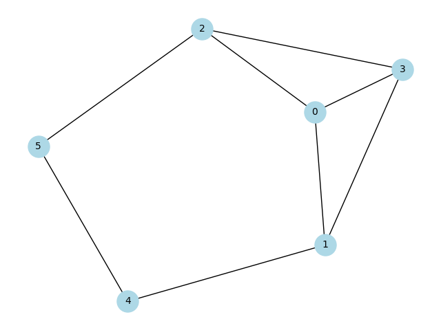
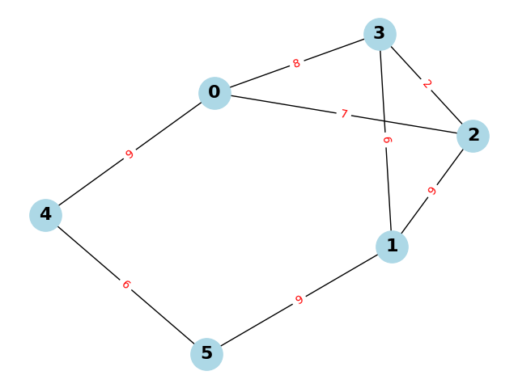
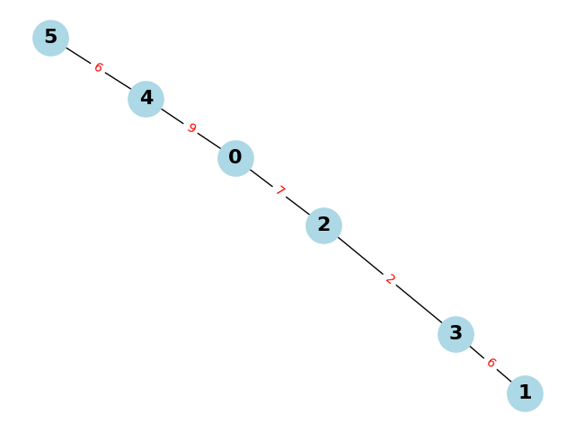

# CGT Assignment

 degree_sequence = [3, 3, 3, 3, 2, 2]

## Havel Hakimi Algorithm : 
 ```
[3, 3, 3, 3, 2, 2] --sort--> [3, 3, 3, 3, 2, 2]
[3, 3, 3, 3, 2, 2] --alg-->[2, 2, 2, 2, 2]
[2, 2, 2, 2, 2] --sort--> [2, 2, 2, 2, 2]
[2, 2, 2, 2, 2] --alg-->[1, 1, 2, 2]
[1, 1, 2, 2] --sort--> [2, 2, 1, 1]
[2, 2, 1, 1] --alg-->[1, 0, 1]
[1, 0, 1] --sort--> [1, 1, 0]
[1, 1, 0] --alg-->[0, 0]
Finished! Graph IS constructable with Havel Hakimi algorithm.
```
## Graph 


## Checking Eulerian Graph and hence finding Euler path using Fluery Algorithm

```
The graph is not Eulerian. The vertices with odd degrees are: [0, 1, 2, 3]
``` 
## Weighted Graph 


## Dijkstra Algorithm Result
```
Enter the starting node for Dijkstra's algorithm: 0
{3: 8, 2: 7, 1: 14, 0: 0, 5: 15, 4: 9}
```

## Min Spanning Tree

### Fundamental Cutset and Circuits
```
Prim's MST: {0: {2: 7, 4: 9}, 2: {3: 2}, 3: {1: 6}, 4: {5: 6}}
Edge: (0, 2), Cutset: [(0, 3), (0, 1), (0, 2), (1, 4), (2, 5)]
Edge: (0, 4), Cutset: [(1, 4), (2, 5)]
Edge: (2, 3), Cutset: [(0, 3), (0, 1), (1, 4), (2, 3)]
Edge: (4, 5), Cutset: [(2, 5), (4, 5)]
Edge: (3, 1), Cutset: [(0, 1), (1, 3), (1, 4)]
Circuit 1: [(0, 2), (2, 3), (3, 0)]
Circuit 2: [(0, 2), (2, 3), (3, 1), (1, 0)]
Circuit 3: [(0, 2), (2, 3), (3, 1), (1, 4), (4, 0)]
Circuit 4: [(0, 2), (2, 5), (5, 4), (4, 0)]
```


## Edge-Vertex-K-connectivity
```
Vertex Connectivity: 2
Vertices to remove to disconnect the graph: (1, 0)
Edge Connectivity: 2
Edges to remove to disconnect the graph: ((1, 5), (0, 4))
The graph is 2-connected.
```